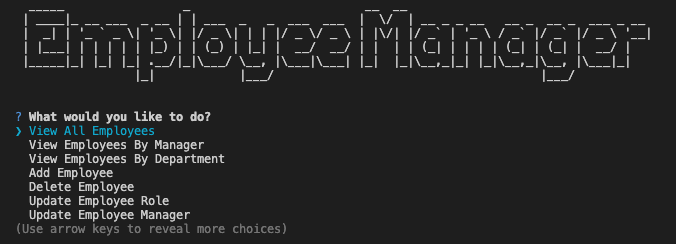

# Module 10 Challenge - Employee Tracker

## Description 

This employee tracker is a command-line application designed to manage a company's employee database. Built with Node.js, Inquirer, and PostgreSQL, it connects to a structured database that organizes the company's departments, roles, and employees. Users can perform various operations to view, add, delete, and manage these records, providing business owners with a tool for planning and organizing their workforce.

## Table of Contents 

- [Installation](#installation)
- [Usage](#usage)
- [Credits](#credits)
- [License](#license)
- [Contributing](#contributing)
- [Tests](#tests)
- [Questions](#questions) 

## Installation 

To install the project, follow the steps below.

1. Clone the repository to your local machine: 
    
    `git clone git@github.com:Connorldailey/Employee-Tracker.git`

2. Navigate to the project folder:

    `cd Employee-Tracker`

3. Install dependencies:

    `npm install`

4. Run the SQL initialization and seed the database (optional):

    `npm run SQL`

5. Start the application:

    `npm start`

The application is now ready to use. 

**NOTE:** PostgreSQL must be installed on your machine to use this application. If you do not have PostgreSQL installed, follow the instructions in this [PostgreSQL Installation Guide](https://coding-boot-camp.github.io/full-stack/postgresql/postgresql-installation-guide).

## Usage 

Once the installation steps are complete, follow these instructions to start and use the Employee Tracker application:

1. Start the Application:

    `npm start`

2. Main Menu:

    You will see a command-line interface with options to manage company departments, roles, and employees. Use the arrow keys to navigate through the options and press `Enter` to select.

3. Available Operations:

    -  View All Departments, Roles, or Employees: Select these options to view a list of all departments, roles, or employees in the database.

    - Add a New Department, Role, or Employee: Choose this option to input details for new records. You will be prompted for information such as department name, role title, salary, and employee details.

    - Update Employee Role or Manager: To modify an existing employee’s role or manager, choose these options and follow the prompts to select the employee and their new role or manager.

    - Delete Departments, Roles, or Employees: Remove specific records from the database by selecting the appropriate option. This action will display a list to choose from.

4. Exiting the Application:

    - When finished, select the `Exit` option in the main menu to safely close the application.

**Note:** Any changes made during your session are saved directly to the database, ensuring all updates remain intact for future sessions. However, running the SQL initialization and seeding, `npm run SQL`, deletes and recreates the database. This should only be used for testing and development purposes.

[Watch the walkthrough video](https://drive.google.com/file/d/1ITglPrjVI0yOwkqhQVAOC1Oms5pLjpqU/view?usp=sharing)

## Credits 

Materials and guidance from The Ohio State University Coding Bootcamp helped lay the foundation for this project.

## License 

This project is licensed under the MIT License - see the [MIT License](https://opensource.org/licenses/MIT) for details. 

## Contributing 

If you would like to contribute to this project, please fork the repository and submit a pull request with detailed explanations of your changes.

## Tests 

There are no specific tests written for this project. However, manual testing of the application has been conducted.

## Questions 

If you have any questions about this project, feel free to reach out: 

- **GitHub:** [connorldailey](https://github.com/connorldailey)
- **Email:** connorldailey@gmail.com
